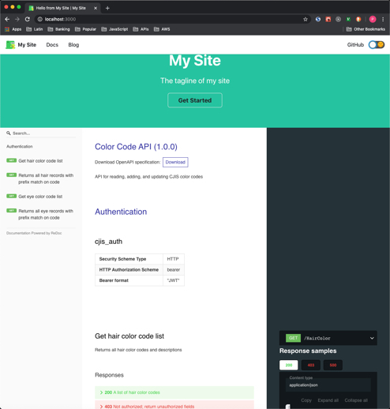

Docusaurus and OpenAPI
----------------------

This repository demonstrates how to resolve dependencies between
[Redoc](https://github.com/Redocly/redoc)
and
[Docusaurus](https://v2.docusaurus.io/docs/)
in order to display OpenAPI documentation along with Docusaurus
documentation.  It simply replaces the original 3 panels with a
sample API doc.
The **goal** is to demonstrate dependencies resolution in a quick way.
My CSS skills are too weak to demonstrate the most beautiful way.
I'm new to both **Docusaurus** and **Redoc**.


## Requirements

You don't need to clone this repository.  You can simply follow the
instructions in this `readme`.  But this repository does included the
`package.json` that resulted from these instructions if you wish to
start from there.  If you clone this repo, then you only have to
run `npm install` to get started.

I assume you know a little about

* Docusaurus
* React
* OpenAPI 3.0
* Node.js/NPM

I use NPM out of habit.  Yarn should also work.

## Steps

These are the steps I used.

1. Create new empty directory and change to it.

2. Initialize a Docusaurus 2 project with classic presets.

   ```console
   $ npx @docusaurus/init init redoc2 classic 
   ```

3. Installed NPM packages for Redoc.

   ```console
   $ cd redoc2
   $ npm install mobx styled-components core-js redoc
   $ npm install
   ```

4. Run the sample site as a check.

   ```console
   $ npm run start
   ```

5. Add `openapi/ColorCode.yaml` from this repository under
   the `static` directory in your new project so that you
   have a `static/openapi/ColorCode.yaml` file.

6. Edit `src/pages/index.js`.  Add `RedocStandalone` import as shown
   below.

   ```javascript
   ...
   import styles from './styles.module.css';
   import { RedocStandalone } from 'redoc';
   ...
   ```

7. Edit `src/pages/index.js`.  Replace the contents of `<main>` tag as
   shown below.

   ```html
   <main>
     <RedocStandalone specUrl="openapi/ColorCode.yaml" />
   </main>
   ```

8. Save `src/pages/index.js` and display page.

Upon refresh, your home page should look like the following.


